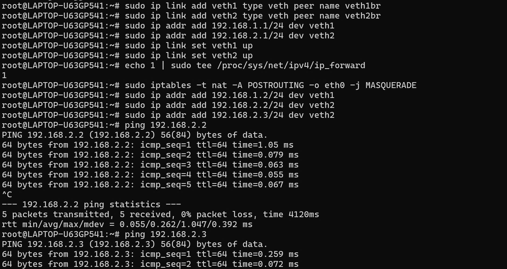
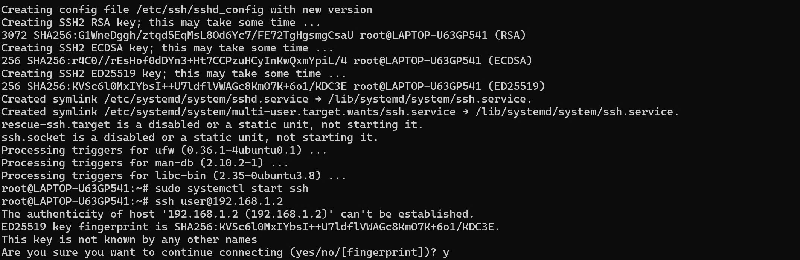
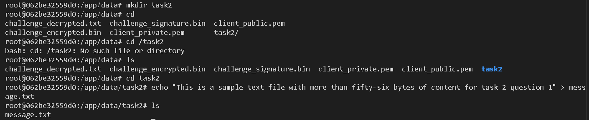
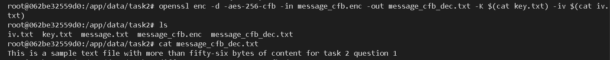
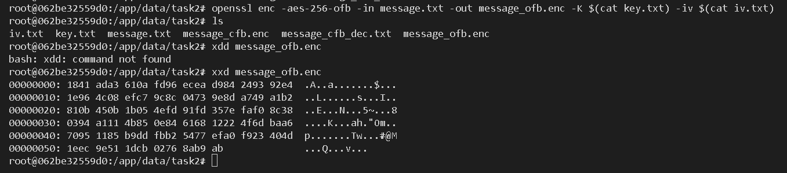
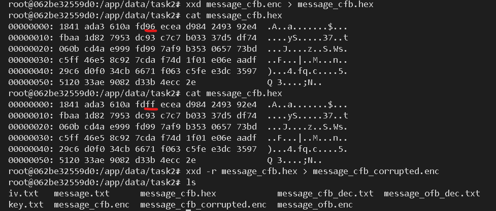

# Network Configuration and Security Lab

## **Question 1: Setup a set of VMs/containers in a network configuration of 2 subnets (1,2) with a router forwarding traffic between them. Relevant services are also required:**

- The router is initially unable to route traffic between subnets.
- PC0 on subnet 1 serves as a web server on subnet 1.
- PC1 and PC2 on subnet 2 act as client workstations on subnet 2.

### **Answer 1:**

1. **Install WSL (Windows Subsystem for Linux):**

   - If not already installed, install WSL:
     ```bash
     wsl --install
     ```

2. **Create 2 Subnets and a Router:**

   - Create a virtual Ethernet (veth) pair to simulate the router's interfaces between subnets:
     ```bash
     sudo ip link add veth1 type veth peer name veth1br
     sudo ip link add veth2 type veth peer name veth2br
     ```
   - Assign IP addresses to the interfaces:
     ```bash
     sudo ip addr add 192.168.1.1/24 dev veth1
     sudo ip addr add 192.168.2.1/24 dev veth2
     ```
   - Bring the interfaces up:
     ```bash
     sudo ip link set veth1 up
     sudo ip link set veth2 up
     ```

3. **Configure IP Addresses for PCs:**

   - **PC0** (Subnet 1):
     ```bash
     sudo ip addr add 192.168.1.2/24 dev veth1
     ```
   - **PC1 and PC2** (Subnet 2):
     ```bash
     sudo ip addr add 192.168.2.2/24 dev veth2  # PC1
     sudo ip addr add 192.168.2.3/24 dev veth2  # PC2
     ```

4. **Verify Connectivity:**
   - Test connectivity between machines:
     `bash
ping 192.168.2.2  # From PC0 to PC1
ping 192.168.2.3  # From PC0 to PC2
`
     <br>

## **Question 2: Enable packet forwarding on the router. Deface the web server's home page with an SSH connection on PC1.**

### **Answer 2:**

1. **Enable IP Forwarding:**

   - On the router (running on WSL), enable packet forwarding:
     ```bash
     sudo sysctl -w net.ipv4.ip_forward=1
     ```

2. **Install SSH Server on PC0:**

   - Install and start SSH on PC0:
     ```bash
     sudo apt install openssh-server
     sudo systemctl start ssh
     ```

3. **SSH from PC1 to PC0 and Modify the Web Page:**
   - SSH into PC0 from PC1:
     ```bash
     ssh user@192.168.1.2
     ```
   - Modify the web server's home page (located at `/var/www/html/index.html`):
     ```bash
     sudo nano /var/www/html/index.html
     ```
     Change the content to something like "Hacked by [Your Name]".
4. **Restart the Web Server:**
   - Restart Nginx to apply the changes:
     ```bash
     sudo systemctl restart nginx
     ```

---

## **Question 3: Configure the router to block SSH to the web server from PC1, leaving SSH/web access normally for all other hosts from subnet 1.**

### **Answer 3:**

1. **Block SSH from PC1 Using iptables:**

   - Use `iptables` to block SSH traffic from PC1 to PC0:
     ```bash
     sudo iptables -A INPUT -s 192.168.2.2 -p tcp --dport 22 -j DROP
     ```

2. **Test Connectivity:**
   - **From PC1**: Try to SSH into PC0:
     ```bash
     ssh user@192.168.1.2  # Should be blocked
     ```
   - **From PC2**: SSH into PC0 (this should work):
     `bash
ssh user@192.168.1.2  # Should work
`
     <br>
     <br>

---

## **Question 4: PC1 now serves as a UDP server, make sure that it can reply to UDP ping from other hosts on both subnets. Configure a personal firewall on PC1 to block UDP accesses from PC2 while leaving UDP access from the server intact.**

### **Answer 4:**

1. **Create a UDP Server on PC1:**

   - Create a simple UDP server using Python on PC1:

     ```python
     # udp_server.py on PC1
     import socket

     server_socket = socket.socket(socket.AF_INET, socket.SOCK_DGRAM)
     server_socket.bind(("0.0.0.0", 9999))

     print("UDP server running...")

     while True:
         data, addr = server_socket.recvfrom(1024)
         print(f"Received message: {data} from {addr}")
         server_socket.sendto(b"ACK", addr)
     ```

   - Run this Python script to start the UDP server.

2. **Configure Firewall on PC1 to Block UDP from PC2:**

   - Use `iptables` to block UDP traffic from PC2:
     ```bash
     sudo iptables -A INPUT -s 192.168.2.3 -p udp --dport 9999 -j DROP
     ```

3. **Test UDP Communication:**
   - **From PC0** (or any other machine) to PC1:
     ```bash
     echo -n "Ping" | nc -u -w1 192.168.2.2 9999
     ```
   - **From PC2** to PC1 (should be blocked):
     ```bash
     echo -n "Ping" | nc -u -w1 192.168.2.2 9999  # This should be blocked by the firewall
     ```

---

## Summary:

- **Question 1**: Created a network setup with 2 subnets and a router between them using `ip` commands in WSL.
- **Question 2**: Enabled IP forwarding and modified the web server's home page using SSH.
- **Question 3**: Configured the router to block SSH from PC1 to PC0 using `iptables`.
- **Question 4**: Set up a UDP server on PC1 and configured a firewall to block UDP from PC2 while allowing UDP from other hosts.

# Task 2: Encrypting large message

Create a text file at least 56 bytes. <br>
**Question 1**:
Encrypt the file with aes-256 cipher in CFB and OFB modes. How do you evaluate both cipher as far as error propagation and adjacent plaintext blocks are concerned. <br>
**Answer 1**:

## 1. Create the message file

_We'll reuse the client container for this lab. First, we'll create a new folder and create the message with at least 56 bytes:_<br>

```sh
mkdir task2
cd task 2
echo "This is a sample text file with more than fifty-six bytes of content for task 2 question 1" > message.txt
```

<br>

We can verify the message size with the following command:

```sh
wc -c message.txt
```

<br>

## 2. Create a key and IV

```sh
openssl rand -hex 32 > key.txt
openssl rand -hex 16 > iv.txt
```

<br>

The first command creates a key text file that has 32 bytes - 256 bits.
The second command creates an IV text file that has 16 bytes - 128 bits.

## 3. Encrypt the file in CFB mode

_We'll encrypt the message using aes 256 in CFB mode with the generated key and iv:_<br>

```sh
openssl enc -aes-256-cfb -in message.txt -out message_cfb.enc -K $(cat key.txt) -iv $(cat iv.txt)
```

<br>

## 4. Decrypt the CFB encrypted message

_We run:_<br>

```sh
openssl enc -d -aes-256-cfb -in message_cfb.enc -out message_cfb_dec.txt -K $(cat key.txt) -iv $(cat iv.txt)
```

<br>

## 5. Encrypt the file in OFB mode

_We'll encrypt the message using aes 256 in OFB mode with the generated key and iv:_<br>

```sh
openssl enc -aes-256-ofb -in message.txt -out message_ofb.enc -K $(cat key.txt) -iv $(cat iv.txt)
```

<br>

## 6. Decrypt the OFB encrypted message

_We run:_<br>

```sh
openssl enc -d -aes-256-ofb -in message_ofb.enc -out message_ofb_dec.txt -K $(cat key.txt) -iv $(cat iv.txt)
```

<br>

## 7. Error propagation of both ciphers

_In CFB mode, an error in the ciphertext affects the current block and propagates into subsequent blocks during decryption. <br><br>
In OFB mode, an error in the ciphertext affects only the corresponding block during decryption._<br><br>

**Question 2**:
Modify the 8th byte of encrypted file in both modes (this emulates corrupted ciphertext).
Decrypt corrupted file, watch the result and give your comment on Chaining dependencies and Error propagation criteria.<br>
**Answer 2**:

## 1. Corrupt the CFB Ciphertext

_We run:_<br>

```sh
xxd message_cfb.enc > message_cfb.hex
xxd -r message_cfb.hex > message_cfb_corrupted.enc
```

We use the first command to convert the file to heximal and the second command the convert it back after we have modified the 8th bit.

<br>
In the above pic, the 8th bit is 96. We modify it to ff.

## 2. Decrypt the Corrupted CFB File

_We run:_<br>

```sh
openssl enc -d -aes-256-cfb -in message_cfb_corrupted.enc -out message_cfb_corrupted_dec.txt -K $(cat key.txt) -iv $(cat iv.txt)
```

<br>
The above shows the decrypted corrupted file using cfb and the original message.

## 3. Corrupt the OFB Ciphertext

_We run:_<br>

```sh
xxd message_ofb.enc > message_ofb.hex
xxd -r message_ofb.hex > message_ofb_corrupted.enc
```

<br>
We repeat the step 1 but on the OFB file. Here we changed the 8th byte 96 to a1.

## 4. Decrypt the Corrupted OFB File

_We run:_<br>

```sh
openssl enc -d -aes-256-ofb -in message_ofb_corrupted.enc -out message_ofb_corrupted_dec.txt -K $(cat key.txt) -iv $(cat iv.txt)
```

<br>
The above shows the decrypted corrupted file using ofb and the original message.

## 5. Comments of CFB and OFB error propogation

In the cfb results: starting from the 8th byte, the errors appear and persist for about 16 characters. This is because CFB uses feedback chaining, where each cipher bock affects the next cipher block. This dependency causes the errors at one block to affect the next one. Because we use AES, each block has 16 bytes, the errors stop after 16 characters.<br><br>
In the ofb results: the error happens on the 8th byte only and the remaining text is decrypted normally. This is because ofb uses keystream independent of the plaintext. The keystream XORs
with the original plaintext so the corruption doesn't spread.
